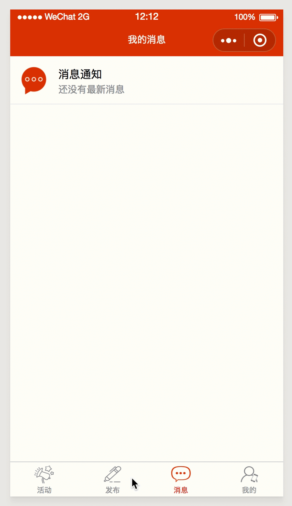

一起呦(微信小程序)
===
>项目启动页面(以下Gif演示有点失真，抱歉！)

 

>项目活动页面

 

>项目地图页面

 

>项目活动详情页面

 

>项目活动发布页面

 

>项目消息页面

 

>项目个人中心页面

 

项目配置
===
>1.配置你的小程序ID和SECRET，在sys_info内 

>2.使用pip install -i requirements.txt 安装需要包 

>3.settings.py配置IMAGES_URL，DATABASES(数据库)， CACHES(Redis服务器) 

>4.项目启动 

>5.后台地址：域名/YiqiAdmin0001shujian/ 
